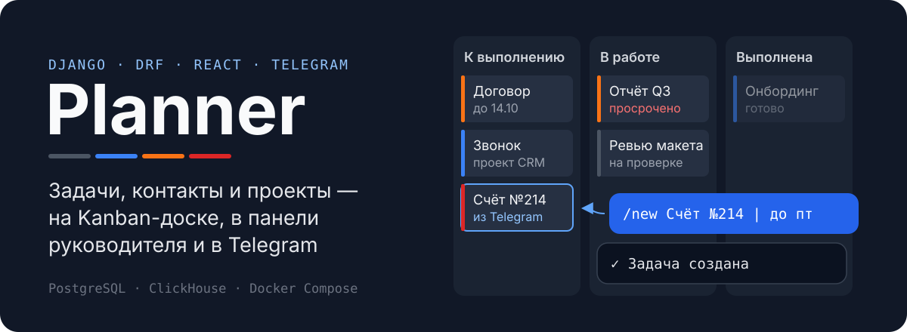
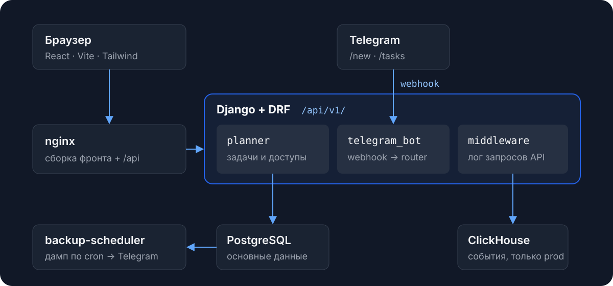

<p align="center">
  
</p>

<p align="center">
  <a href="https://github.com/Unseen-social-network/task-manager/actions/workflows/ci.yml"></a>
  
</p>

Planner — веб-приложение для команды, где задачи, контакты и проекты лежат в одном месте. Задачу можно завести в браузере или одной командой в Telegram, а руководитель сразу видит просрочки, очередь на проверку и перегруженных сотрудников.

## Что умеет

- **Задачи** — список и Kanban-доска, настраиваемые статусы, срочность, сроки, комментарии, вложения, учёт времени и помодоро-таймер, экспорт в Excel.
- **Панель руководителя** — KPI, оповещения и блокеры, баланс нагрузки по сотрудникам и быстрые фильтры (подробнее ниже).
- **Контакты и проекты** — общий доступ по ссылке и приглашения в команду.
- **Telegram-бот** — создание и просмотр задач из чата и уведомления, когда вас отметили в задаче.
- **Резервные копии** — ежедневный дамп PostgreSQL (и ClickHouse в проде), который отправляется в Telegram.

## Как устроено

<p align="center">
  
</p>

Backend на Django + DRF отдаёт REST API по `/api/v1/`, авторизация через JWT. Frontend — React + Vite + Tailwind, собирается в статику, которую раздаёт nginx. Telegram присылает обновления на webhook приложения `telegram_bot`, а роутер передаёт их обработчикам команд. В проде middleware пишет события API в ClickHouse, и они попадают в аналитику для staff (`/api/v1/analytics/`). Подробности о логах и ClickHouse — в [`infra/LOGGING_AND_ANALYTICS.md`](infra/LOGGING_AND_ANALYTICS.md).

## Быстрый старт (dev)

```bash
cp .env.example .env   # заполните переменные
make build
make up
make migrate           # `make up` миграции не применяет
make createsuperuser
```

| Что | Адрес |
| --- | --- |
| Frontend | http://localhost:3000 |
| Backend | http://localhost:8000 |
| Админка | http://localhost:8000/admin |
| API docs | http://localhost:8000/api/schema/swagger-ui/ |

Vite с hot reload вместо собранного фронтенда:

```bash
docker compose -f infra/compose/docker-compose.yml --profile dev up -d frontend-dev
```

Все цели Makefile с описаниями выводит `make help`.

## Проверки

```bash
make lint            # pre-commit: ruff, ruff-format, django-upgrade
make test            # pytest на SQLite, Postgres не нужен
make frontend-check  # eslint + сборка (сначала make frontend-install)
make all-pre-CI      # всё сразу
```

CI дополнительно проверяет, что нет несозданных миграций (`manage.py makemigrations --check`).

## Production

```bash
make prod-build
make prod-up         # поднимает стек, применяет миграции и collectstatic
```

Стек описан в `docker-compose.production.yml`: PostgreSQL, ClickHouse, backend на Gunicorn, backup-scheduler и nginx.

## Панель руководителя

| Блок | Что показывает |
| --- | --- |
| Карточки задач | Цветная полоса слева и значок срочности показывают приоритет |
| KPI | Активные задачи, просрочки, задачи на проверке, перегруженные исполнители |
| Оповещения и блокеры | Просроченные, заблокированные и ожидающие проверки задачи |
| Баланс нагрузки | Полосы по сотрудникам: кто перегружен, а кто свободен |
| Умные фильтры | Быстрый фокус на рисках, просрочках и согласованиях |

Начинайте с блоков «Оповещения и блокеры» и «Баланс нагрузки»: по ним видно, какие риски снять и кому передать задачи.

Подсказки на панели:

- **«Очередь на проверку»** — задачи, которые ждут ревью или согласования.
- **«Задачи с риском задержки»** — задачи с высоким приоритетом и близким сроком.
- **«Самые перегруженные сотрудники»** — у кого больше всего активных задач. Если таких нет, показывается «Сегодня перегруженных нет.»

## Telegram-бот

Сначала привяжите аккаунт: в настройках профиля нажмите «Подключить Telegram-бота», перейдите по ссылке и отправьте боту `/start <token>`.

| Команда | Что делает |
| --- | --- |
| `/new Заголовок \| Описание` | Быстро создаёт задачу |
| `/newfull` | Создаёт задачу в диалоге со всеми полями |
| `/tasks`, `/tasks todo` | Показывает активные задачи или задачи с указанным статусом |
| `/task <id>` | Показывает одну задачу |
| `/help` | Выводит справку |

<details>
<summary>REST-эндпоинты для внешнего бот-клиента</summary>

Все запросы идентифицируют пользователя по `chat_id`.

- `GET /api/v1/telegram/help/` — текст справки, готовый к показу.
- `POST /api/v1/telegram/tasks/quick/` — `chat_id`, `title`, `description` (опционально).
- `GET /api/v1/telegram/tasks/` — `chat_id`, `status` (`active`, `todo`, `in_progress`, `done`, `canceled`; без него — все задачи), `limit` (по умолчанию 20).

В ответах есть шаблон `task_url_template` вида `https://<frontend>/tasks?task={id}`: подставьте `id` задачи, чтобы получить ссылку для сообщения бота.

</details>

## Резервные копии

Отдельный Telegram-бот присылает в личные сообщения дамп `pg_dump` в формате `.dump`. Если задан `CLICKHOUSE_HOST`, он отправляет ещё и ClickHouse-бэкап в `.zip`. В проде расписание выполняет контейнер `backup-scheduler` (`python manage.py run_backup_scheduler`).

```bash
make send-backup        # отправить дамп сейчас (dev)
make prod-send-backup   # то же в проде
make load-backup DUMP=planner_YYYYMMDD_HHMMSS.dump   # восстановить локально
```

<details>
<summary>Переменные окружения</summary>

| Переменная | Назначение |
| --- | --- |
| `TELEGRAM_BACKUP_BOT_TOKEN` | Токен бота для бэкапов |
| `TELEGRAM_BACKUP_USER_ID` | Ваш Telegram user id |
| `TELEGRAM_BACKUP_ENABLED` | Включить отправку (`1`/`0`) |
| `TELEGRAM_BACKUP_CRON` | Расписание, например `0 10 * * *` |
| `TELEGRAM_BACKUP_WITH_STATS` | Добавлять статистику ВМ (`1`/`0`) |
| `TELEGRAM_BACKUP_SEND_STATS_MESSAGE` | Слать статистику отдельным сообщением (`1`/`0`) |
| `TELEGRAM_BACKUP_TIMEOUT` | Таймаут запросов к Telegram API, сек (по умолчанию 20) |

</details>
